# Microservice-microblogging APP

ubuntu -
/etc/hosts

insert following line-

192.168.58.2 posts.com

##### the above ip is recieved by following command-

❯ code /etc/hosts

❯ minikube ip

192.168.58.2

[https://kubernetes.github.io/ingress-nginx/deploy/#minikube](https://kubernetes.github.io/ingress-nginx/deploy/#minikube)

Run following commands in respective terminal for each service

$ npm start

$ docker build -t duttaani/event-bus .

$ docker run duttaani/event-bus  

$ minikube start

$ minikube addons enable ingress

$ kubectl version

$ kubectl apply -f posts.yaml 

$ kubectl get pods -o wide

$ kubectl exec posts -- it sh

$ kubectl delete pod posts

$ kubectl describe pod posts

$ kubectl get deployments

$ docker push duttaani/posts

$ kubectl rollout restart deployment posts-depl

$ kubectl logs posts-depl-6c745ddd69-t9xvg

$ kubectl get services

$ kubectl describe service posts-srv

$ kubectl apply -f .

$ minikube addons enable ingress

$ sudo lsof -i tcp:80

$ code /etc/hosts

$ minikube ip

$ scaffold dev

   
  

  

  

  

  

  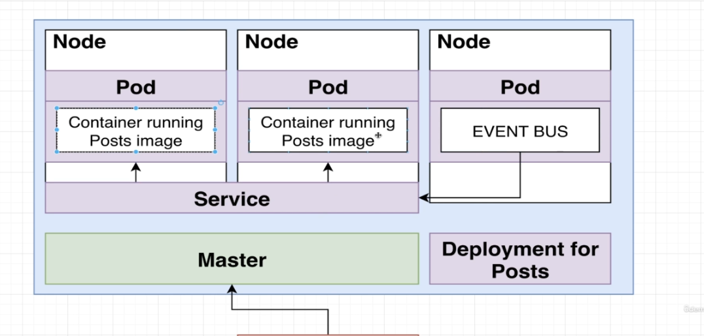

  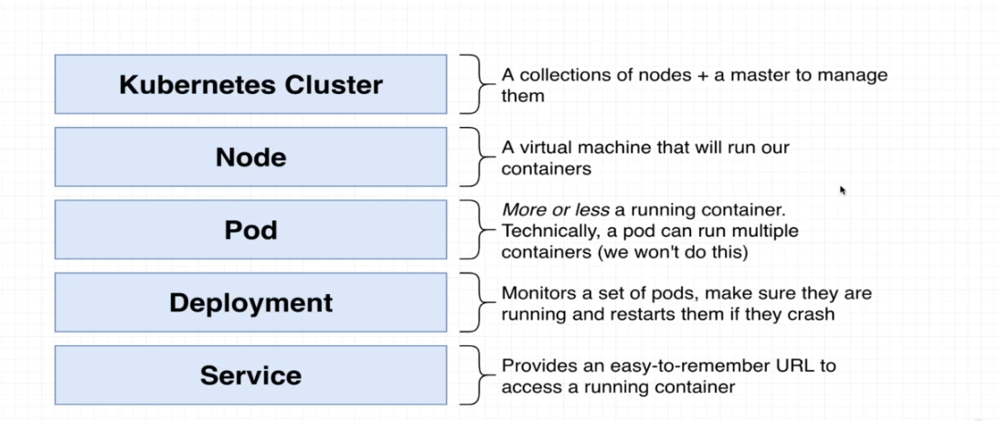

  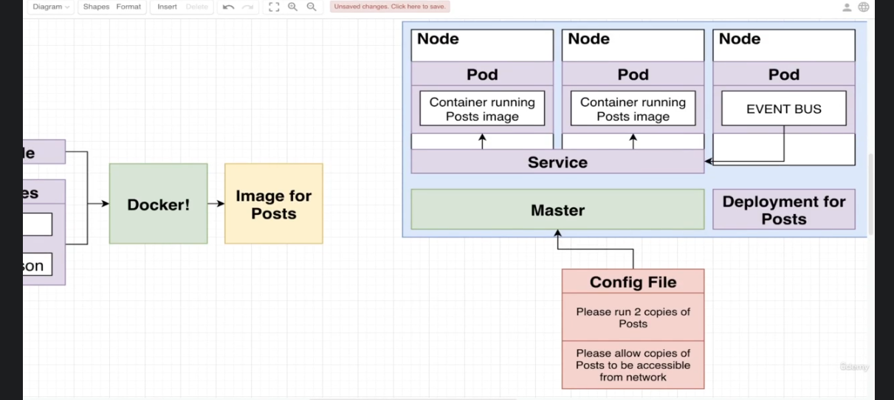

  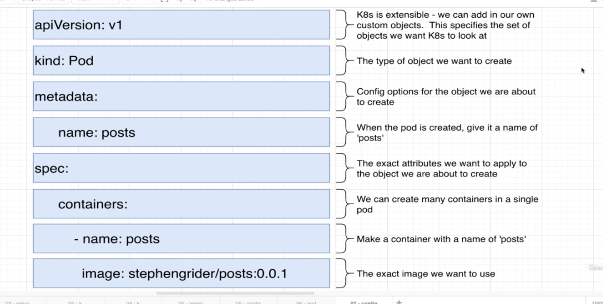

  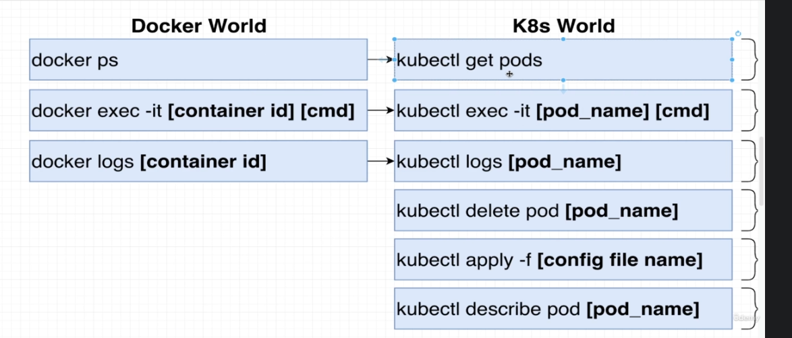

  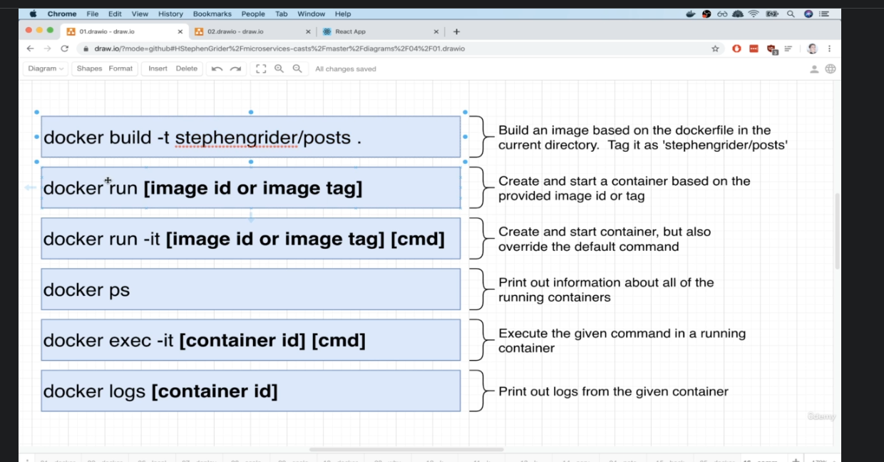

  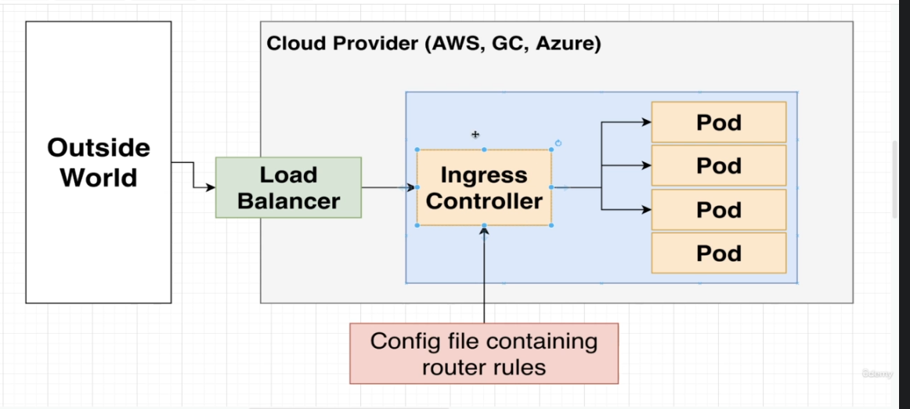

  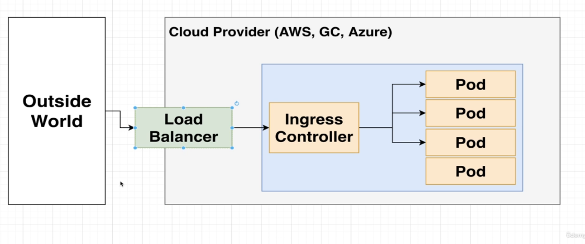

  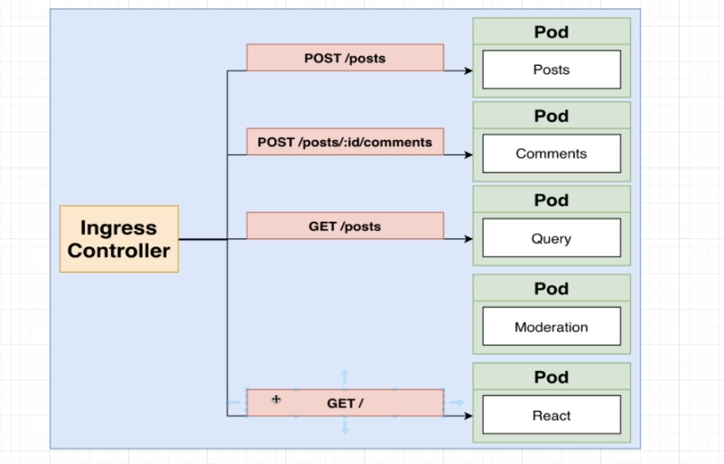

  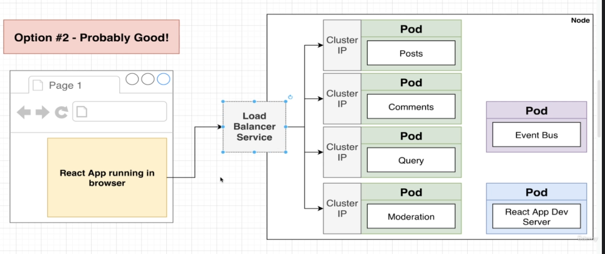

  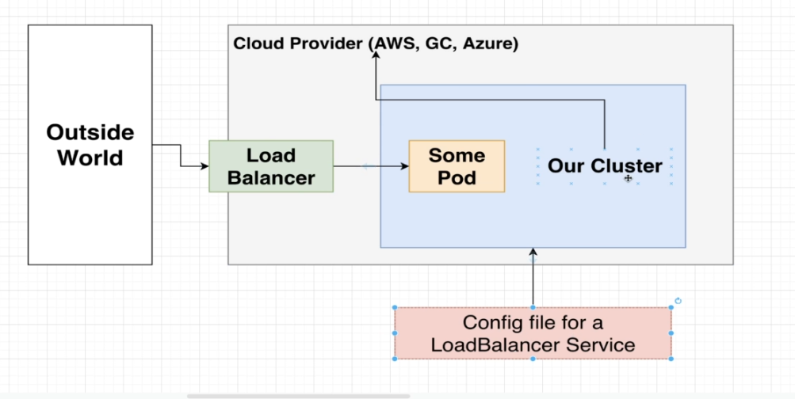

  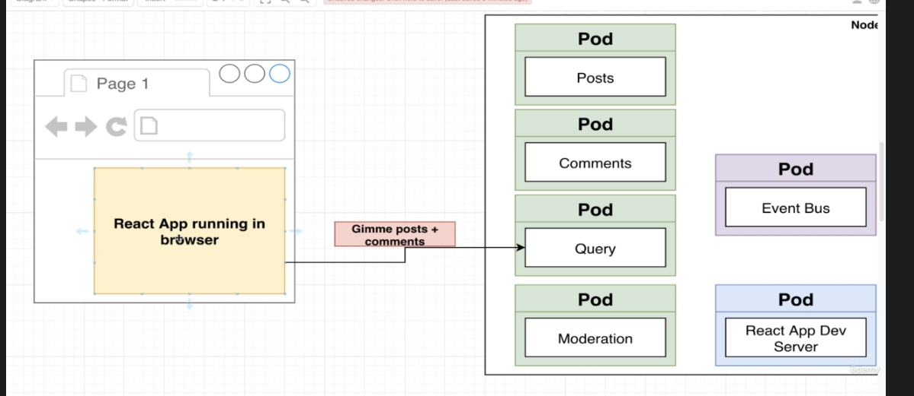

