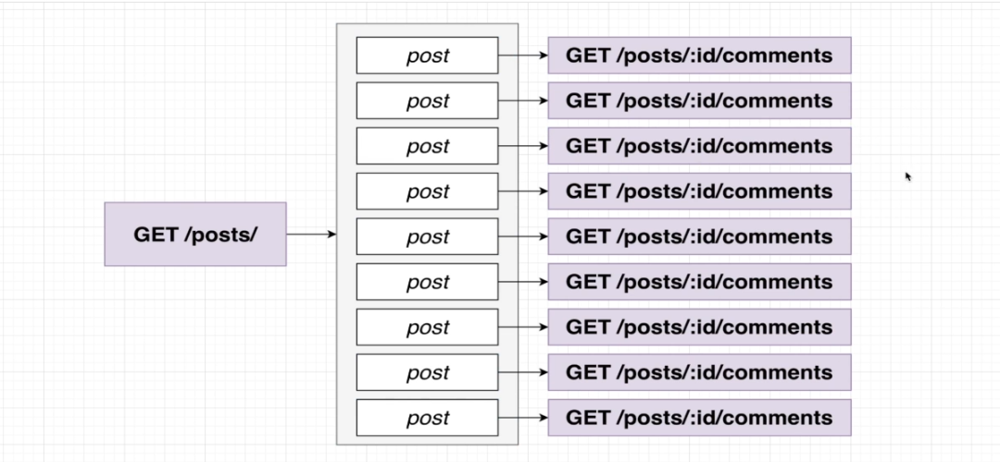
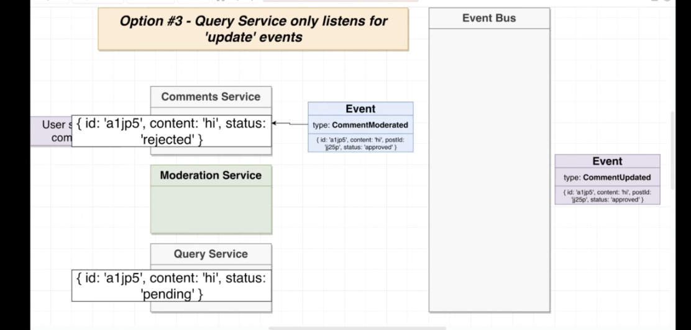
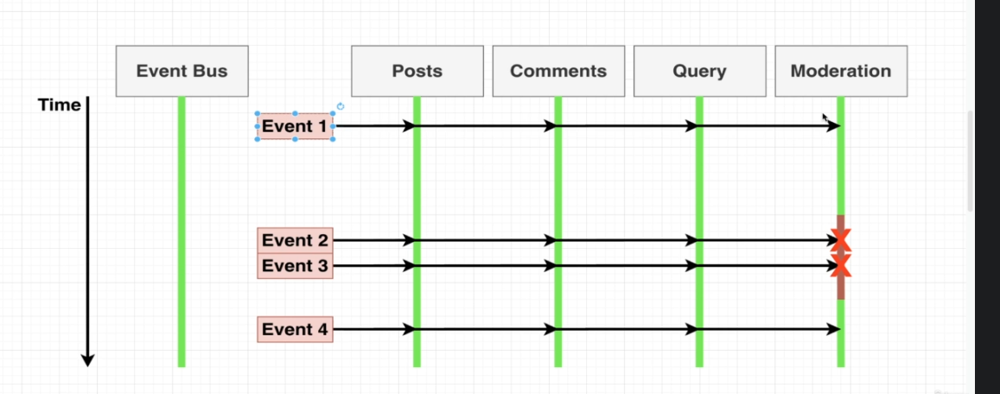
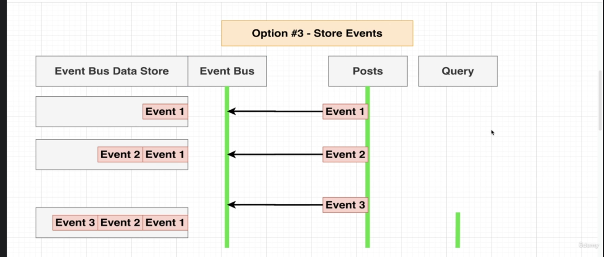
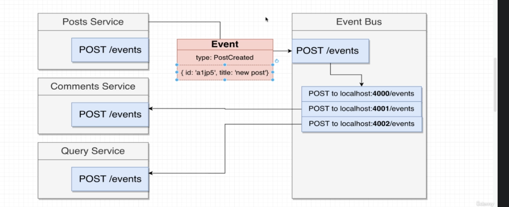

# Microservice-microblogging APP

Run following commands in respective terminal for each service

$ npm start

$ docker build -t duttaani/event-bus .

$ docker run duttaani/event-bus  

$ minikube start

$ kubectl version

$ kubectl apply -f posts.yaml 

$ kubectl get pods -o wide

$ kubectl exec posts -- it sh

$ kubectl delete pod posts

$ kubectl describe pod posts

$ kubectl get deployments

$ docker push duttaani/posts

$ kubectl rollout restart deployment posts-depl

$ kubectl logs posts-depl-6c745ddd69-t9xvg

   
  

  

  

  

  

